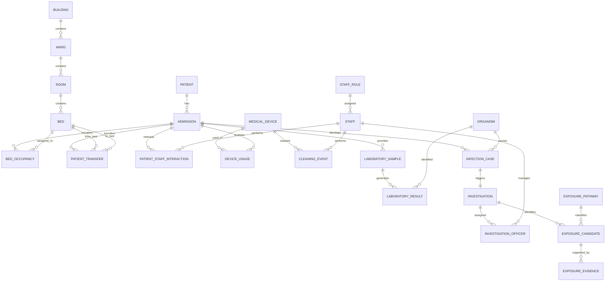

# ER Diagram (Crow's Foot)

```mermaid
erDiagram

PATIENT ||--o{ ADMISSION : has

BUILDING ||--o{ WARD : contains
WARD ||--o{ ROOM : contains
ROOM ||--o{ BED : contains

ADMISSION ||--o{ BED_OCCUPANCY : occupies
BED ||--o{ BED_OCCUPANCY : assigned_to

ADMISSION ||--o{ PATIENT_TRANSFER : transfers
BED ||--o{ PATIENT_TRANSFER : from_bed
BED ||--o{ PATIENT_TRANSFER : to_bed

STAFF_ROLE ||--o{ STAFF : assigned

ADMISSION ||--o{ PATIENT_STAFF_INTERACTION : interacts
STAFF ||--o{ PATIENT_STAFF_INTERACTION : performs

MEDICAL_DEVICE ||--o{ DEVICE_USAGE : used_in
ADMISSION ||--o{ DEVICE_USAGE : receives

MEDICAL_DEVICE ||--o{ CLEANING_EVENT : cleaned
STAFF ||--o{ CLEANING_EVENT : performs

ADMISSION ||--o{ LABORATORY_SAMPLE : provides
LABORATORY_SAMPLE ||--o{ LABORATORY_RESULT : generates
ORGANISM ||--o{ LABORATORY_RESULT : identified

ADMISSION ||--o{ INFECTION_CASE : develops
ORGANISM ||--o{ INFECTION_CASE : causes

INFECTION_CASE ||--|| INVESTIGATION : triggers

INVESTIGATION ||--o{ INVESTIGATION_OFFICER : assigned
STAFF ||--o{ INVESTIGATION_OFFICER : manages

INVESTIGATION ||--o{ EXPOSURE_CANDIDATE : identifies
EXPOSURE_PATHWAY ||--o{ EXPOSURE_CANDIDATE : classifies

EXPOSURE_CANDIDATE ||--o{ EXPOSURE_EVIDENCE : supported_by
```
